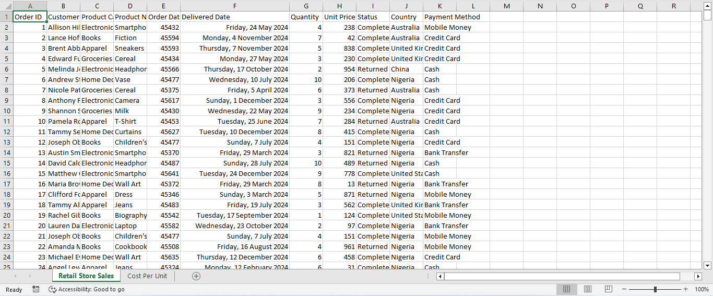
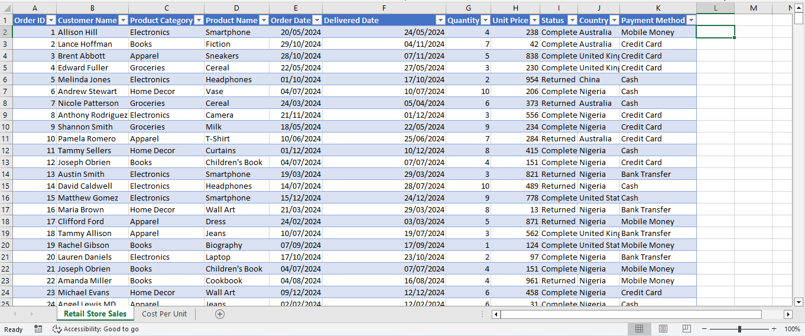
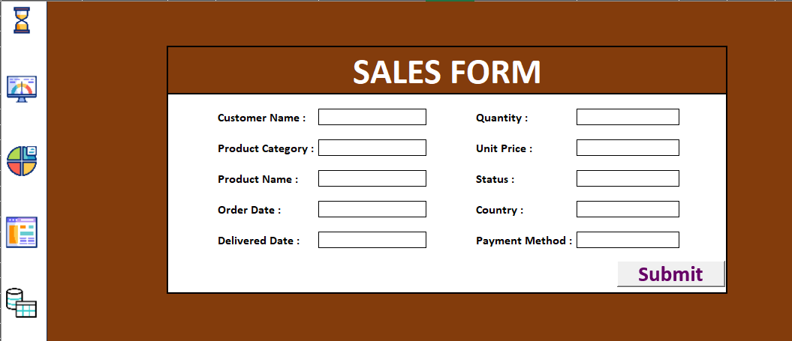

# 📊 Excel Data Analysis Project: Sales Analysis and Order Management.

### 📁 Project Summary
This project was designed to address key operational challenges faced by a retail business through data-driven insights. I developed a fully automated and dynamic Excel dashboard that seamlessly integrates data collection, cleaning, analysis, and visualization. The solution serves as a self-sustaining tool that enables stakeholders to make informed decisions and enhance operational efficiency with minimal manual intervention.

#### ⚠️ Disclaimer
*_The dataset and findings presented in this project do not reflect any real company, organization, or country. 
This project was developed solely to demonstrate my data analysis skills and proficiency in Microsoft Excel._*

### 🎯 Project Objectives
1. Analyze trends and patterns in order statuses (Completed vs. Returned).
2. Test two competing hypotheses regarding delivery time and its influence on return rates:
  - H₀ (Null): Delivery time has no impact on returns.
  - H₁ (Alternative): Orders with longer delivery times are more likely to be returned.
3. Build a dynamic Excel dashboard that automates the end-to-end data analysis workflow.

### 🧹 Data Cleaning
- Standardized Formats: Ensured consistency across date, time, numeric, and text formats.
- Validation: Performed column-by-column error checking and corrected irregularities (e.g., spacing, capitalization).
- Duplicates Removed: Eliminated repeated entries to maintain data integrity.
- Missing Values: Filled critical missing data (e.g., revenue) using mean imputation.

**Raw data (Before data cleaning)**              |  **Raw data (After data cleaning)**
:----------------------------------------------: | :------------------------------:
                                |    
[Download data here](sales_data.xlsx)            |  [Download data here](Cleaned_data.xlsx)

### 🛠 Data Processing
- Derived Columns: Extracted Day, Month, Year, and calculated Profit from existing Order Date and numeric fields.
- VLOOKUP: Linked related tables to enrich data context.
- Filtering & Sorting: Structured the dataset to focus on relevant subsets for analysis.

### 📈 Exploratory Data Analysis (EDA)
- Descriptive Statistics: Uncovered key data patterns, distributions, and outliers.
- Hypothesis Testing (Two-Sample t-Test): Tested the influence of delivery time on return likelihood.
- Validated results statistically to drive actionable insights.

### 🔁 Automated Data Pipeline
- Data Entry Form: Built a user-friendly Excel form using VBA to allow seamless data input and data collection.
- Macro-Driven Automation:
  - Submission button populates and stores data.
  - Confirmation pop-up upon successful submission.
  - Automatic form reset for new entries.

**Automated Form**    |
:----------------------------------------------: |
                                |

### 📊 Interactive Dashboard
**The dashboard was designed to be user-friendly, interactive, and highly informative. Below are its key features:**

**Key Performance Indicators (KPIs):** Used Pivot Tables to calculate and display important metrics such as Revenue, Cost, Profit, Return Rate, and Delivery Time.

**Dynamic Visualizations:** Charts were created to visually represent trends and patterns in the data, making insights easy to understand at a glance.

**Interactive Navigation and Filtering:** Slicers were added to enable real-time filtering of the dashboard based on selected criteria.

**Dynamic Buttons were created to enhance user experience and navigation across the workbook:**
- Refresh Button – Instantly updates the dashboard with the latest data.
- EDA Button – Navigates to the Exploratory Data Analysis sheet containing the t-test results and interpretations.
- Automated Form Button – Leads to the sheet containing the automated data entry form.
- Database Button – Opens the raw data sheet where submitted entries are stored.
- Dashboard Button – Takes users back to the dashboard.

These features work together to ensure the dashboard is not only informative but also easy to use for non-technical stakeholders.
Interpretation: There is a statistically significant relationship between delivery time and return rate.

**Refresh Button** | **EDA Button** |**Automated Form Button**| **Database Button** | **Dashboard Button**
:----------------: | :-------------:| :---------------------: | :-----------------: | :----------------: |
   |    |            |    |  |
